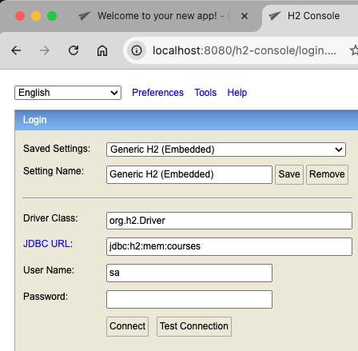
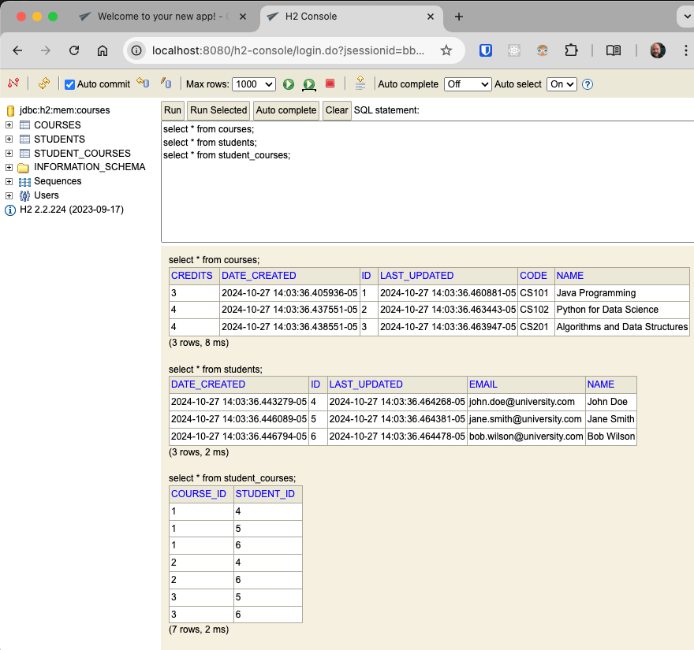
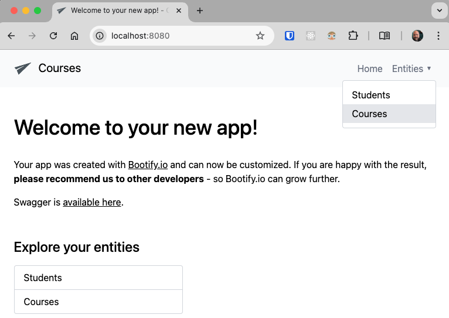
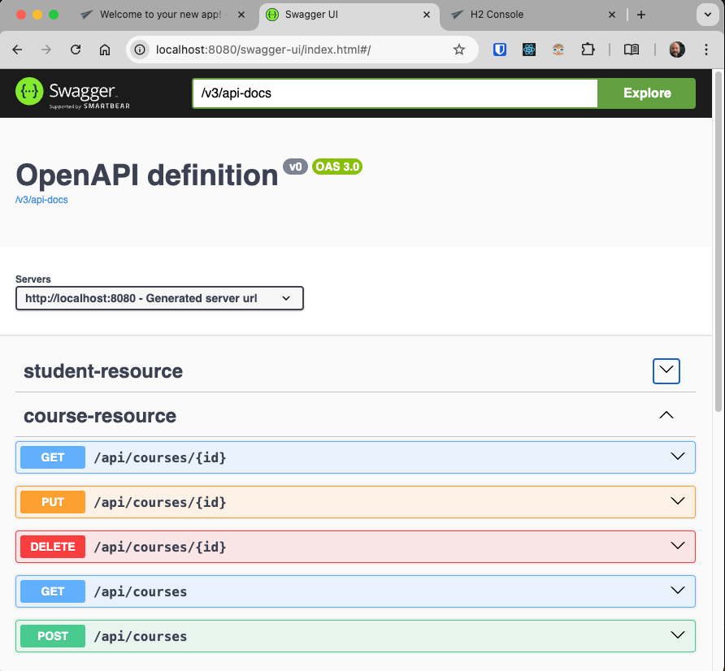

# A quick java spring boot app to explore JPA & many to many relationship with Lazy loading

An interesting unit test is [CourseLazyLoadingTest.java](https://github.com/payne/courses/blob/main/src/test/java/org/mattpayne/toy/courses/CourseLazyLoadingTest.java#78) which 
explores lazy loading.  

1. It outputs the SQL generated by JPA to the log (stdout).  
2. Shows off the use of `@Transactional` to avoid `LazyInitializationException`.
3. It shows how to use `@Query` to avoid N+1 queries.
4. Shows using `Hibernate.isInitialized(obj)` to see if obj has been fetched from the database.

## In memory h2 database
run `mvn spring-boot:run` to start the application then visit http://localhost:8080/h2-console to view the database

## Simple GUI

Visit http://localhost:8080/ to view the app

## Swagger included

